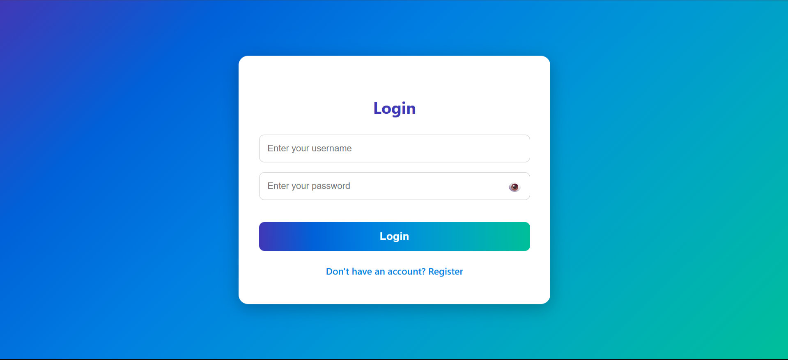
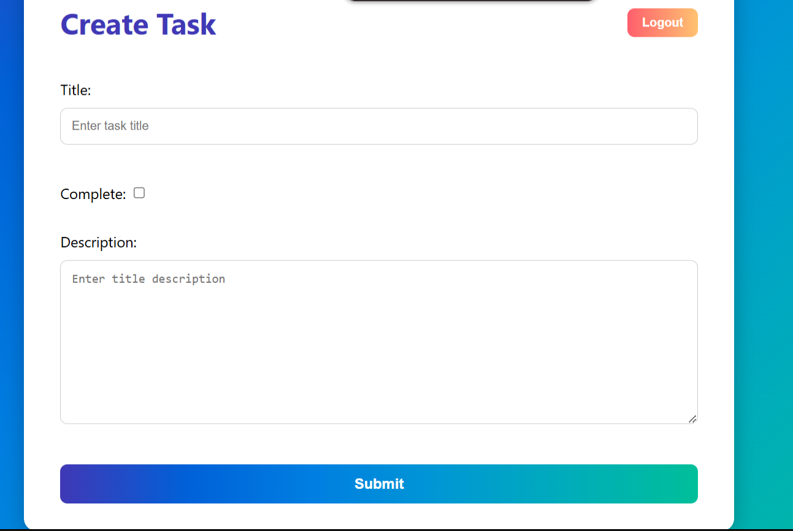
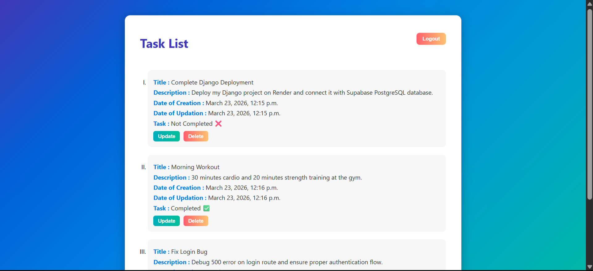

# 📝 ToDo Task Web Application

A full-stack ToDo web application built using **Django** and **MySQL**, deployed using **Docker**, **Gunicorn**, and **Nginx** on an Oracle Cloud VM.

---

## 🚀 Live Demo

🔗 [https://tasks.backendforge.qd.je](https://tasks.backendforge.qd.je)

---

## 🎯 Features

- 🔐 User Authentication (Register, Login, Logout)
- ✏️ Create, Update, Delete Tasks
- ✅ Mark Tasks as Complete/Incomplete
- 👤 User-Specific Task Management
- 🔒 Secure Password Hashing using Django Authentication
- 🐳 Dockerized Deployment
- 🌐 Custom Domain with Nginx Reverse Proxy
- 🗄️ MySQL Database Integration
- ⚡ Production Ready Setup with Gunicorn and WhiteNoise

---

## 🛠️ Tech Stack

| Layer | Technology |
|-------|-----------|
| **Backend** | Python, Django 5.2 |
| **Database** | MySQL |
| **Deployment** | Docker, Gunicorn, Nginx, Oracle Cloud VM |
| **Static Files** | WhiteNoise |
| **Configuration** | python-decouple |

---

## 🏗️ Architecture

```
User Browser
     ↓
Nginx Reverse Proxy
     ↓
Docker Container
     ↓
Gunicorn
     ↓
Django Application
     ↓
MySQL Database
```

---

## 📁 Project Structure

```
Task/
├── settings.py
├── urls.py
├── wsgi.py
└── ...
todo/
├── models.py
├── views.py
├── urls.py
├── templates/
└── migrations/
requirements.txt
manage.py
Dockerfile
.env (not included in repository)
```

---

## ⚙️ Local Installation

### 1. Clone the Repository

```bash
git clone https://github.com/yashsaxena15/ToDo-Task.git
cd ToDo-Task
```

### 2. Create Virtual Environment

```bash
python -m venv venv

# Linux / macOS
source venv/bin/activate

# Windows
venv\Scripts\activate
```

### 3. Install Dependencies

```bash
pip install -r requirements.txt
```

### 4. Configure Environment Variables

Create a `.env` file:

```env
SECRET_KEY=your_secret_key
DEBUG=True
DB_NAME=todo_db
DB_USER=your_username
DB_PASSWORD=your_password
DB_HOST=your_host
DB_PORT=3306
```

### 5. Apply Migrations

```bash
python manage.py migrate
```

### 6. Run Development Server

```bash
python manage.py runserver
```

---

## 🐳 Docker Deployment

### Build Docker Image

```bash
docker build -t todo-app .
```

### Run Container

```bash
docker run -d \
  --name todo-app \
  -p 8001:8000 \
  --env-file .env \
  --restart unless-stopped \
  todo-app
```

### Check Container Status

```bash
docker ps
docker logs -f todo-app
```

---

## 🌐 Nginx Configuration

Example reverse proxy configuration:

```nginx
server {
    listen 80;
    server_name tasks.backendforge.qd.je;

    location / {
        proxy_pass http://127.0.0.1:8001;
        proxy_set_header Host $host;
        proxy_set_header X-Real-IP $remote_addr;
        proxy_set_header X-Forwarded-For $proxy_add_x_forwarded_for;
        proxy_set_header X-Forwarded-Proto $scheme;
    }
}
```

---

## 🧠 Skills Demonstrated

- Django Development
- Authentication & Authorization
- MySQL Database Management
- Docker Containerization
- Linux Server Administration
- Nginx Reverse Proxy Configuration
- Cloud Deployment
- Git & GitHub Workflow
- Production Debugging & Monitoring

---

## 📚 Key Learnings

- Django Deployment on Production Servers
- Docker-Based Application Hosting
- Connecting Django with MySQL
- Managing Environment Variables Securely
- Reverse Proxy Setup using Nginx
- Deploying Applications on Oracle Cloud Infrastructure
- Debugging Production Issues

---
## 📸 Screenshots
### Login Page


### Create Task


### Task Dashboard


## 📬 Contact

- **GitHub:** [https://github.com/yashsaxena15](https://github.com/yashsaxena15)
- **LinkedIn:** [https://www.linkedin.com/in/yashsaxena15](https://www.linkedin.com/in/yashsaxena15)

---

⭐ If you found this project useful, please consider giving it a **star** on GitHub!